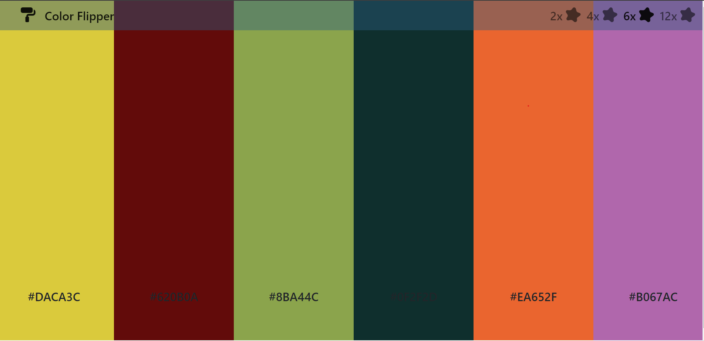

# Color Flipper

For a developer or a designer colors are one of the most important elements.
Color Flipper hepls you with it. All you need to do is just click randomly on screen and pick your color.

## Authors

-   [MehmetFK](https://github.com/HaciGustav/)

## Demo Link

https://hacigustav.github.io/Color-Flipper/

## Screenshots

## Lessons Learned

-   JavaScript Events
-   Creating random values with Loops
-   DOM Traversing

## Styling

Used Bootstrap and CSS

## Cloned Page

https://coolors.co/
